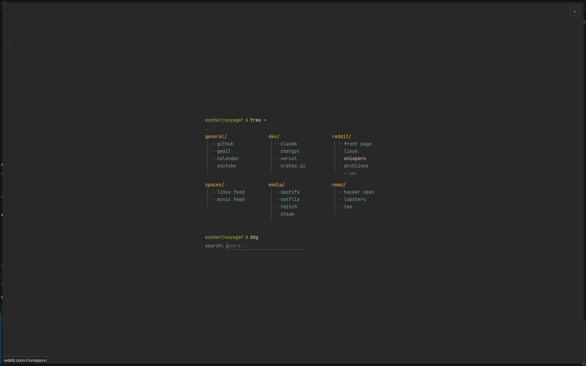

# HomeBase

A terminal-style browser start page with live feeds, a plugin system, and full in-browser editing. No build step, no framework, no config files to touch.

### Main dashboard
The terminal-style `tree ~` layout — link trees grouped by category, with a DuckDuckGo search bar at the bottom. Everything is editable inline, no config files.



### Plugin install — API credentials
When a plugin needs an API key (like `tmdb_trending`), a modal prompts you to paste it in. Keys are stored locally and never leave your machine.


### Live plugin feed — TMDB trending
After installing the TMDB plugin, a `tmdb_trending/` tree appears on your dashboard with live movie data pulled from The Movie Database — watchlist items starred, trending titles listed below.


---

## What it is

HomeBase is a heavily expanded spiritual successor to [StartTree](https://github.com/Paul-Houser/StartTree) by Paul Houser. Where the original generates a static HTML file from a YAML config, HomeBase is a fully interactive app with two layers:

- **`index.html`** — standalone start page. Drop it in your browser and it works. All config lives in `localStorage`. Nothing to install.
- **`server.py`** — optional FastAPI backend (`localhost:6969`) that powers live feeds: Reddit, RSS, YouTube, weather, and Ollama AI summaries. Runs as a systemd user service.

---

## Features

### Core
- **Live editing** — add, rename, reorder trees and links directly in the UI. No config files, no regeneration.
- **Multi-page** — multiple pages with `←` / `→` to switch, each with its own layout, trees, and theme
- **6 built-in themes** — Gruvbox, Nord, Catppuccin, Dracula, Tokyo Night, One Dark
- **Custom themes** — build your own with 16 color pickers, save and share as JSON
- **Configurable search** — DuckDuckGo, Google, Bing, Brave, Kagi, YouTube, or any custom engine with a `{q}` URL template
- **Quick-add** — hover any tree to add a link inline, no settings panel needed
- **Export / import** — full config backup and restore as JSON
- **Drag-to-reorder** — trees and links are reorderable with HTML5 drag and drop

### Plugin system
Drop a file, get a live-updating link feed. Two tiers:

**Tier 1 — Declarative JSON** (anyone can write one)

Drop a `.json` file into `plugins/` or drag it onto the HomeBase window to auto-install and create a tree.

```json
{
  "name": "Hacker News",
  "source": {
    "type": "rss",
    "url": "https://hnrss.org/frontpage"
  },
  "map": {
    "label": "title",
    "url": "link"
  },
  "limit": 20,
  "refreshMs": 3600000
}
```

Works with any RSS feed or JSON API. API keys go in `headers` and stay local on your machine.

```json
{
  "name": "Raindrop Bookmarks",
  "source": {
    "url": "https://api.raindrop.io/rest/v1/raindrops/0",
    "headers": { "Authorization": "Bearer YOUR_TOKEN" }
  },
  "map": { "array": "items", "label": "title", "url": "link" },
  "refreshMs": 3600000
}
```

**Tier 2 — Python scripts** (for devs)

Drop a `.py` file into `plugins/`. Expose an `async def plugin()` that returns `[{label, url}]`. Optional `REFRESH_MS` constant (default 15 min). Full access to `httpx`, any Python library.

```python
import httpx

REFRESH_MS = 900_000

async def plugin():
    async with httpx.AsyncClient() as client:
        r = await client.get("https://api.example.com/items")
        return [{"label": i["title"], "url": i["url"]} for i in r.json()["results"]]
```

**Bundled plugins:**
| File | What it pulls |
|---|---|
| `hacker-news.json` | HN front page via RSS |
| `lobsters.json` | Lobste.rs front page |
| `raindrop_bookmarks.py` | Raindrop.io bookmarks |
| `raindrop_collections.py` | Raindrop.io collections |
| `tmdb.py` | TMDB watchlist |
| `tmdb_trending.py` | TMDB trending movies |

**CORS proxy** — `GET /api/proxy?url=<url>` fetches any URL server-side to bypass browser CORS restrictions. Point a JSON plugin at it to hit any API without CORS issues.

### Backend live feeds (server.py)

When the server is running, pages like `linux.html` and `music.html` pull live content organized into **spaces** — named content buckets each with their own subreddits, RSS feeds, and optional weather.

| Endpoint | What it does |
|---|---|
| `GET /api/space/{name}` | Returns Reddit posts + RSS items + weather + AI summary for a space |
| `GET /api/refresh/{name}` | Busts cache and re-fetches |
| `GET /api/plugin/{name}` | Serves a plugin's live data |
| `GET /api/proxy?url=` | CORS proxy for external APIs |
| `POST /api/config/{space}/subreddits/add` | Add a subreddit in-browser |
| `POST /api/config/{space}/rss/add` | Add an RSS feed in-browser |

Feed data is cached as JSON with a 1-hour TTL. **Ollama AI summaries** call `localhost:11434` (model `qwen2.5:3b`) — failure is silent, summary just returns empty.

---

## Setup

### Standalone (no backend)

Just open `index.html` in your browser. Set it as your new tab page with an extension like [Custom New Tab URL](https://chrome.google.com/webstore/detail/custom-new-tab-url/mmjbdbjnoablegbcapnhobbgbamncndg).

No dependencies, no build step. Everything is in one file.

### With the backend

```bash
# install Python deps
pip install fastapi uvicorn httpx feedparser

# run directly
python3 server.py

# or install as a systemd user service (starts on login)
bash setup.sh
```

Check it's running:
```bash
curl http://localhost:6969/api/health
```

Force-refresh a space's cache:
```bash
curl http://localhost:6969/api/refresh/linux
```

Logs:
```bash
journalctl --user -u zen-dashboard -f
```

---

## Settings panel

Open with ⚙ (top right):

| Tab | What's in it |
|---|---|
| **Links** | Manage trees and links, drag to reorder |
| **Page** | Theme picker, custom colors, grid layout (columns/rows) |
| **Search** | Search engine picker, add custom engines |

---

## Color system

16 CSS custom properties control every color. The full palette:

| Variable | Role |
|---|---|
| `--bg` | Page background |
| `--bg1` | Settings header |
| `--bg2` | Settings panel |
| `--bg3` | Tree card background |
| `--br` / `--br2` | Border / border highlight |
| `--fg` / `--fg2` / `--fg3` | Text / muted / dim |
| `--yellow` | Tree names, active state |
| `--cyan` | Links |
| `--green` | Username, add buttons |
| `--red` | Delete actions |
| `--purple` | Panel title |
| `--orange` | Accent |

---

## Writing a plugin

The fastest way to get started is to copy `plugins/hacker-news.json` and swap the URL. For anything that needs auth or custom logic, copy `plugins/raindrop_bookmarks.py`.

Plugin files go in `plugins/` or you can drag-and-drop them directly onto HomeBase — the server registers them automatically and a tree appears with live data.

---

## Credits

Inspired by [StartTree](https://github.com/Paul-Houser/StartTree) by [Paul Houser](https://github.com/Paul-Houser), which itself was inspired by a start page originally at notabug.org/nytly/home.
